「どのブラウザで開いても同じ見た目で表示される」

私たち当たり前のように受け入れているこの状況が当たり前ではないことが分かったのでその気づきをまとめました。

## ブラウザとは何なのか

ブラウザとは、Web コンテンツの処理、ネットワーク通信、ストレージ、セキュリティ、ブラウザ UI など、ユーザーが Web を利用するために必要な機能をまとめたソフトウェアです。

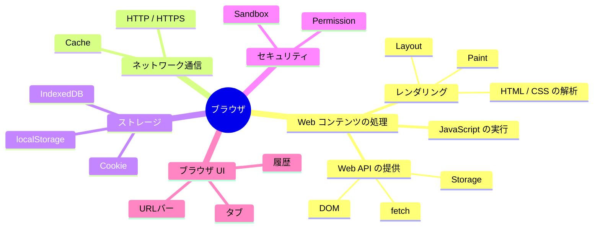

以降、主要ブラウザ（Chrome、Safari、Firefox）の Web コンテンツの処理における差異をまとめました。

## レンダリング

HTML / CSS の解析やレイアウト、描画など、Web ページを画面に表示するまでの一連の処理を**レンダリング**と呼びます。

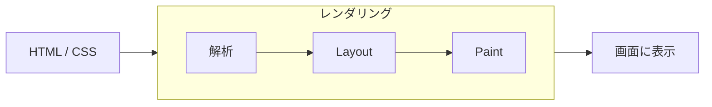

### 主要ブラウザのレンダリング実装

主要ブラウザでは、レンダリングを担う実装がそれぞれ異なります。

| ブラウザ | レンダリングを担う主な実装 |
| --- | --- |
| Chrome | Blink |
| Safari | WebCore |
| Firefox | Gecko |

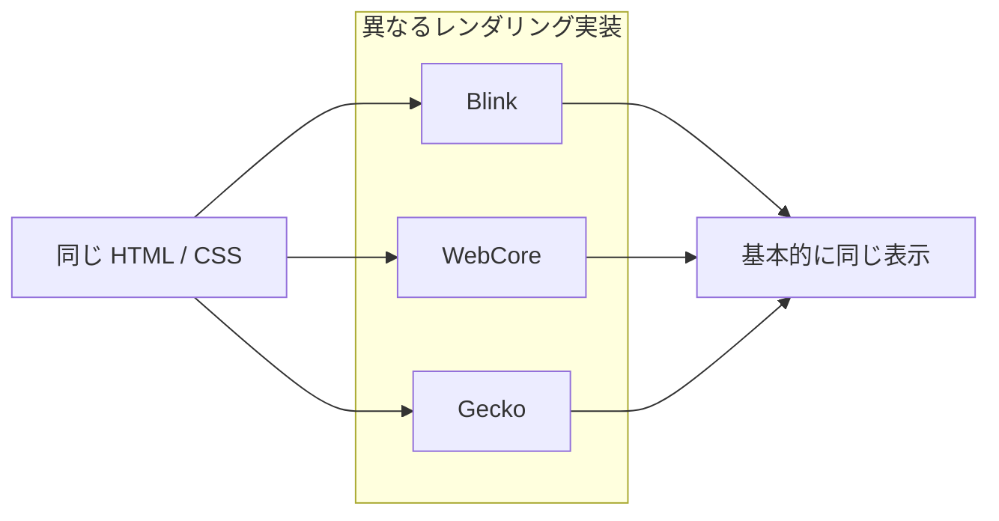

### なぜ大体同じ表示になるのか

HTML / CSS の解釈方法は Web 標準として仕様化されています。  

Chrome、Safari、Firefox はそれぞれ異なるレンダリング実装を持っていますが、いずれも同じ Web 標準に従って HTML / CSS を解釈するよう実装されています。  
そのため、実装そのものは異なっていても、同じ HTML / CSS からは基本的に同じ結果が得られます。

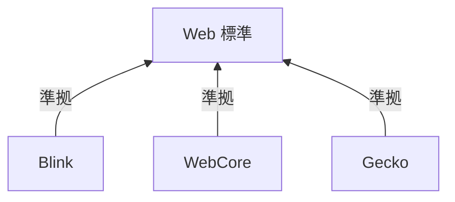

さらに、Web Platform Tests によって、各ブラウザの仕様への適合性や相互運用性が継続的に検証されています。

## Web API の提供

DOM、fetch、Storage など、Web コンテンツから利用できるブラウザの機能群を **Web API** と呼びます。

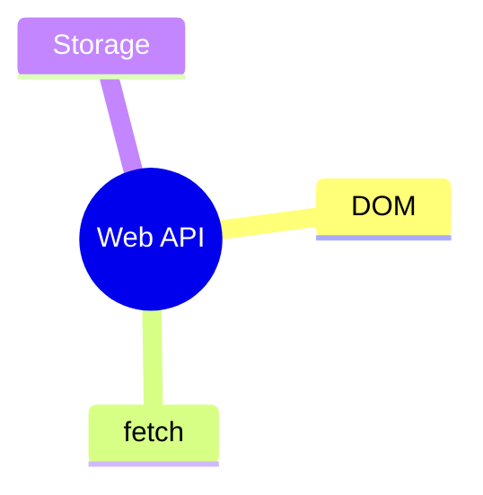

Web API の振る舞いも、HTML / CSS と同様に Web 標準として共通の仕様が定められています。

Chrome、Safari、Firefox は、それぞれ異なる内部実装を持ちながらも、これらの共通仕様に従って Web API を提供しています。

### 主要ブラウザの Web API 実装

主要ブラウザでは、Web API を実現する内部実装がそれぞれ異なります。また、Web API という 1 つのまとまった実装が存在するわけではなく、DOM、fetch、Storage など、API によって処理を担うコンポーネントや連携先が異なります。

| ブラウザ | DOM | fetch | Storage |
| --- | --- | --- | --- |
| Chrome | Blink | Network Service | Storage 系実装 |
| Safari | WebCore | NetworkProcess | NetworkProcess / Storage 系実装 |
| Firefox | Gecko | Necko | Storage 系実装 |

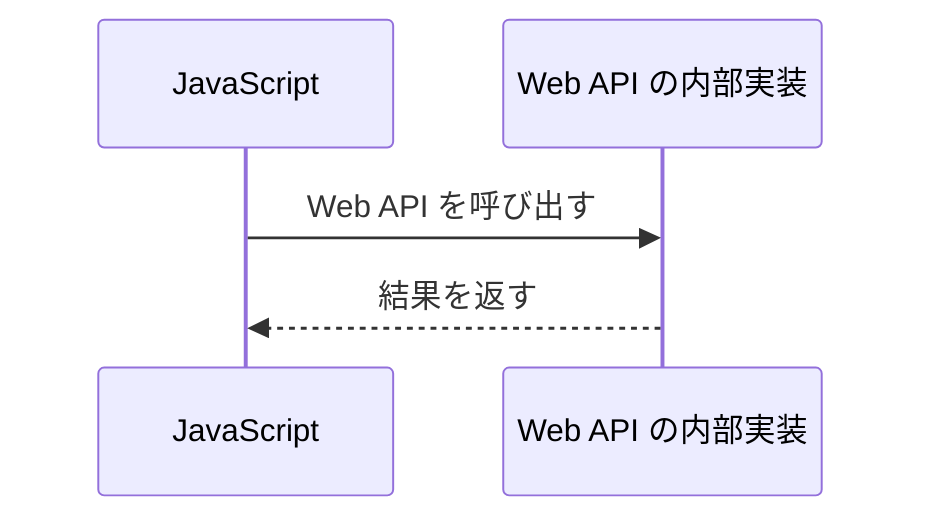

### ブラウザによる対応状況の違い

Web API は共通の仕様に基づいて実装されていますが、すべてのブラウザで同じ API が同じタイミング・同じ範囲で利用できるとは限りません。

あるブラウザでは利用できる API が別のブラウザでは未対応だったり、同じ API でも一部の機能だけが未実装だったりすることがあります。

そのため、Web API におけるブラウザ差は、主に **API の対応状況や実装範囲の違い** として現れます。

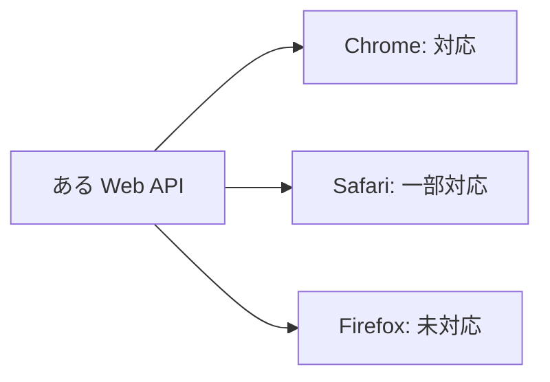

## JavaScript の実行

JavaScript の解析や実行を担うブラウザの仕組みを **JavaScript エンジン** と呼びます。

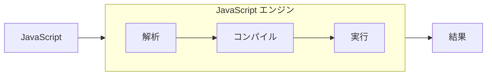

### 主要ブラウザの JavaScript エンジン

主要ブラウザでは、JavaScript エンジンがそれぞれ異なります。

| ブラウザ | JavaScript エンジン |
| --- | --- |
| Chrome | V8 |
| Safari | JavaScriptCore |
| Firefox | SpiderMonkey |

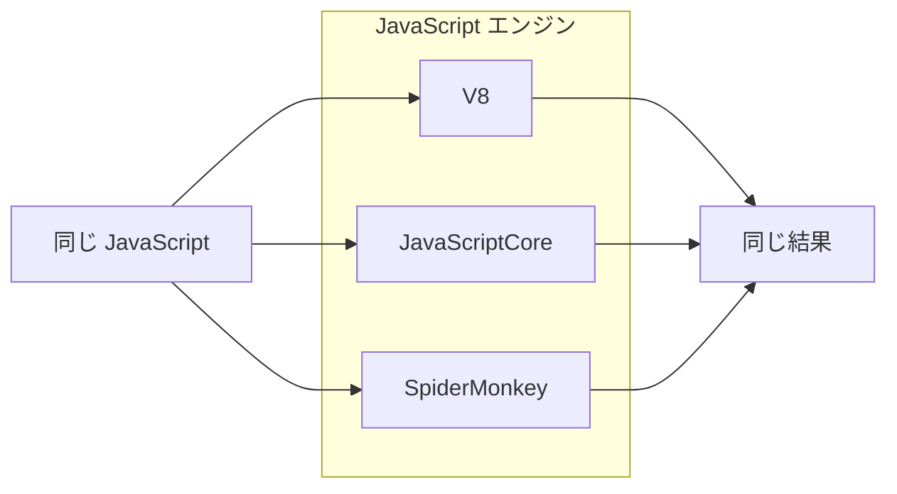

### なぜ大体同じように動くのか

JavaScript の言語仕様は **ECMAScript** として標準化されています。

V8、JavaScriptCore、SpiderMonkey はそれぞれ異なる実装ですが、いずれも同じ ECMAScript の仕様に従って JavaScript を実行するよう実装されています。  
そのため、同じ仕様に対応している範囲では、基本的にどのブラウザでも同じ JavaScript から同じ結果が得られます。

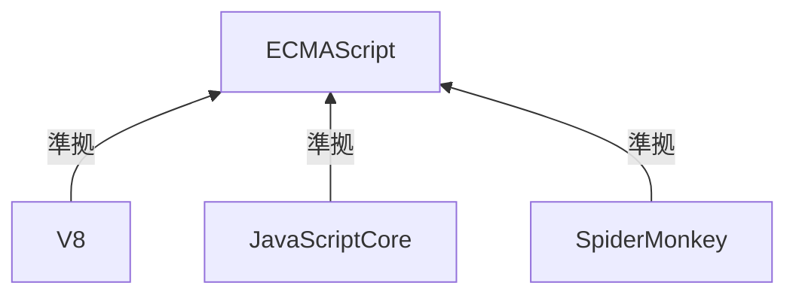

### JavaScript エンジンによる差異

一方で、JavaScript エンジンごとに新しい ECMAScript の機能へ対応する時期が異なることがあります。

また、実行結果が同じでも、JIT コンパイルやガベージコレクションなどの内部実装は異なるため、実行速度やメモリ使用量には差が生じます。

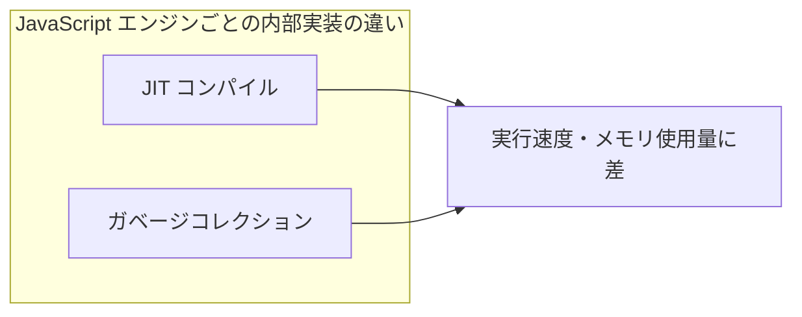

## 「ブラウザの差」はどこで生じるのか

ここまで見てきたように、「ブラウザの差」は 1 つの原因から生じるものではありません。

開発者から見ると、主に次のレイヤーの違いとして現れます。

- HTML / CSS の表示差は、レンダリング実装や CSS の対応状況の違い
- Web API の差は、API の対応状況や実装範囲の違い
- JavaScript の差は、ECMAScript の対応状況や JavaScript エンジンの内部実装の違い

Web 標準によって多くの振る舞いは共通化されていますが、各ブラウザはそれぞれ異なる実装を持っています。  
そのためブラウザ差に遭遇したときは、**どの実装レイヤーの差なのか**を見ることで原因を追いやすくなります。

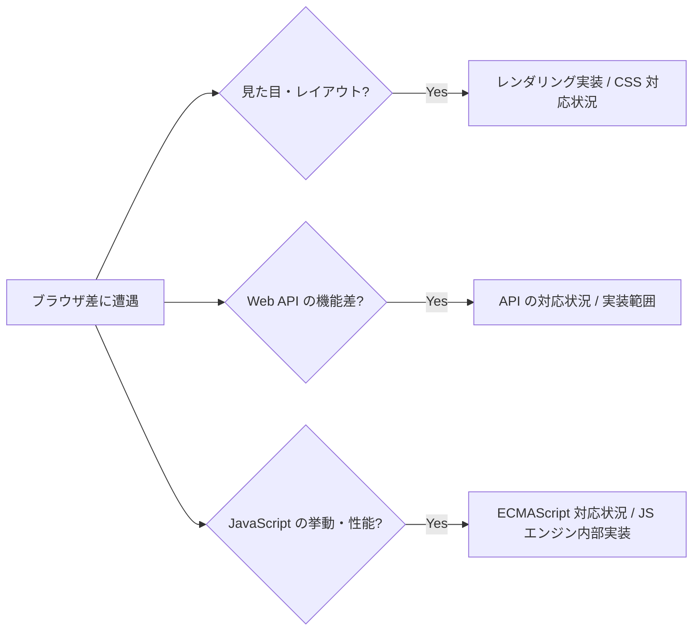

## References

### Web 標準

- [HTML Living Standard - WHATWG](https://html.spec.whatwg.org/)
- [CSS Snapshot - W3C](https://www.w3.org/TR/css-2025/)
- [DOM Standard - WHATWG](https://dom.spec.whatwg.org/)
- [Fetch Standard - WHATWG](https://fetch.spec.whatwg.org/)
- [Storage Standard - WHATWG](https://storage.spec.whatwg.org/)
- [ECMAScript Language Specification - TC39](https://tc39.es/ecma262/)
- [web-platform-tests documentation](https://web-platform-tests.org/)

### ブラウザの実装

- [Blink - The Chromium Projects](https://www.chromium.org/blink/)
- [Introduction to WebKit - WebKit Documentation](https://docs.webkit.org/Getting%20Started/Introduction.html)
- [Gecko - Firefox Source Docs](https://firefox-source-docs.mozilla.org/overview/gecko.html)
- [Network Service - Chromium](https://chromium.googlesource.com/chromium/src/+/HEAD/services/network/README.md)
- [WebKit Multi-Process Architecture - WebKit Documentation](https://docs.webkit.org/Deep%20Dive/Architecture/WebKit2.html)
- [Storage - WebKit Documentation](https://docs.webkit.org/Deep%20Dive/Architecture/Storage.html)
- [Networking - Firefox Source Docs](https://firefox-source-docs.mozilla.org/networking/index.html)

### JavaScript エンジン

- [V8 JavaScript engine](https://v8.dev/)
- [JavaScriptCore - WebKit Documentation](https://docs.webkit.org/Deep%20Dive/JSC/JavaScriptCore.html)
- [SpiderMonkey - Firefox Source Docs](https://firefox-source-docs.mozilla.org/js/index.html)
