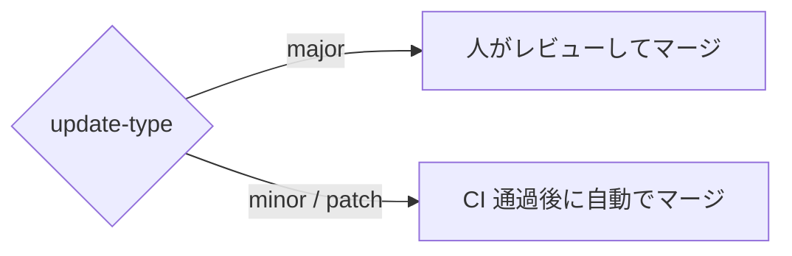
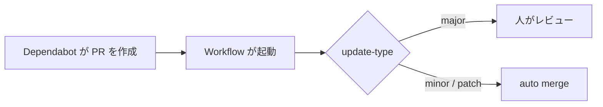

Dependabot の自動 PR のうち、影響の小さい minor, patch 更新についてはマージ作業の手間を減らしたいと思っています。



## 設定方法

### groups で major とそれ以外を分ける

`groups` を使うと、条件に一致する更新を 1 つの PR にまとめられます。

```yaml
groups:
  major:
    patterns:
      - "*"
    update-types:
      - "major"
  minor-patch:
    patterns:
      - "*"
    update-types:
      - "minor"
      - "patch"
```

`patterns: ["*"]` で全パッケージを対象にしつつ、`update-types` で major と minor/patch を別グループに分けます。

### minor / patch 更新を auto merge する

Dependabot が作成した PR に auto merge を設定する GitHub Actions ワークフローを作成します。

```yaml
- uses: dependabot/fetch-metadata@25dd0e34f4fe68f24cc83900b1fe3fe149efef98 # v3.1.0
  id: metadata
  with:
    github-token: ${{ secrets.GITHUB_TOKEN }}
- if: |
    steps.metadata.outputs.update-type == 'version-update:semver-minor' ||
    steps.metadata.outputs.update-type == 'version-update:semver-patch'
  run: gh pr merge --auto "$PR_URL"
```

`dependabot/fetch-metadata` は PR の `update-type` を出力します。
グループ化された PR に複数の update-type が混在する場合、`update-type` には最も大きい変更 (major > minor > patch) が出力されます。

`update-type` が minor または patch であれば `gh pr merge --auto` で auto merge を有効にします。
PR の必須チェック（CI）が通ると自動でマージされます。



## オプション項目

### deps と deps-dev を分けるのもおすすめ

`groups` には `dependency-type` も指定できます。

```yaml
groups:
  deps:
    dependency-type: "production"
  deps-dev:
    dependency-type: "development"
```

`dependencies` と `devDependencies` を別 PR に分けておくと、本番のビルド成果物に影響するかどうかを PR の時点で判断しやすくなります。major/minor-patch の分け方と組み合わせれば、影響範囲と破壊的変更の可能性という 2 つの軸で PR を整理できます。

### セキュリティ要件によっては cooldown を設定する

cooldown は、依存関係の新しいバージョンがリリースされてから一定期間が経過するまで、そのバージョンへの更新 PR を作成しないようにする機能です。リリース直後のバージョンに悪意のあるコードが混入していた場合に、気づかないまま自動更新してしまうサプライチェーン攻撃のリスクを下げられます。

`cooldown` を明示的に設定しなくても、Dependabot はデフォルトで 3 日間のクールダウン期間を適用します。

デフォルトの期間から変更したい場合は、`cooldown` を追加します。

```yaml
cooldown:
  default-days: 7
  semver-major-days: 14
  semver-minor-days: 7
  semver-patch-days: 3
```

`default-days` は個別指定のない依存関係に適用されるクールダウン期間です。SemVer に対応するパッケージマネージャーでは `semver-major-days` / `semver-minor-days` / `semver-patch-days` で更新種別ごとに期間を分けて指定でき、指定しなかった種別は `default-days` にフォールバックします。

### 更新時刻を指定する

`schedule` には `interval` の他に `time` と `timezone` も指定できます。開発作業の都合を勘案して設定するとよいです。

```yaml
schedule:
  interval: "daily"
  time: "08:00"
  timezone: "Asia/Tokyo"
```

## 完成形

ここまで紹介した設定を組み合わせると、次のようになります（deps / deps-dev の分割を除く）。

### dependabot.yml

```yaml title="dependabot.yml"
version: 2
updates:
  - package-ecosystem: "npm"
    directory: "/"
    schedule:
      interval: "daily"
      time: "08:00"
      timezone: "Asia/Tokyo"
    groups:
      major:
        patterns:
          - "*"
        update-types:
          - "major"
      minor-patch:
        patterns:
          - "*"
        update-types:
          - "minor"
          - "patch"
    cooldown:
      default-days: 7
      semver-major-days: 14
      semver-minor-days: 7
      semver-patch-days: 3
```

### auto merge ワークフロー

```yaml title="dependabot-auto-merge.yml"
name: Dependabot auto-merge

on: pull_request

permissions:
  contents: write
  pull-requests: write

jobs:
  dependabot:
    runs-on: ubuntu-latest
    if: github.actor == 'dependabot[bot]'
    steps:
      - uses: dependabot/fetch-metadata@25dd0e34f4fe68f24cc83900b1fe3fe149efef98 # v3.1.0
        id: metadata
        with:
          github-token: ${{ secrets.GITHUB_TOKEN }}
      - if: |
          steps.metadata.outputs.update-type == 'version-update:semver-minor' ||
          steps.metadata.outputs.update-type == 'version-update:semver-patch'
        run: gh pr merge --auto "$PR_URL"
        env:
          PR_URL: ${{ github.event.pull_request.html_url }}
          GH_TOKEN: ${{ secrets.GITHUB_TOKEN }}
```

## まとめ

- `groups` の `update-types` で major と minor / patch の PR を分ける
- `dependabot/fetch-metadata` の `update-type` を見て、minor / patch だけ `gh pr merge --auto` する
- `groups` の `dependency-type` で deps と deps-dev を分ける
- `cooldown` でリリース直後のバージョンへの更新を遅らせる
- `schedule` の `time` / `timezone` で更新チェックの時刻を指定する

## References

- [Automating Dependabot with GitHub Actions - GitHub Docs](https://docs.github.com/en/code-security/tutorials/secure-your-dependencies/automate-dependabot-with-actions)
- [Automatically merging a pull request - GitHub Docs](https://docs.github.com/en/pull-requests/how-tos/merge-and-close-pull-requests/automatically-merging-a-pull-request)
- [Managing auto-merge for pull requests in your repository - GitHub Docs](https://docs.github.com/en/repositories/configuring-branches-and-merges-in-your-repository/configuring-pull-request-merges/managing-auto-merge-for-pull-requests-in-your-repository)
- [Dependabot options reference - GitHub Docs](https://docs.github.com/en/code-security/reference/supply-chain-security/dependabot-options-reference)

