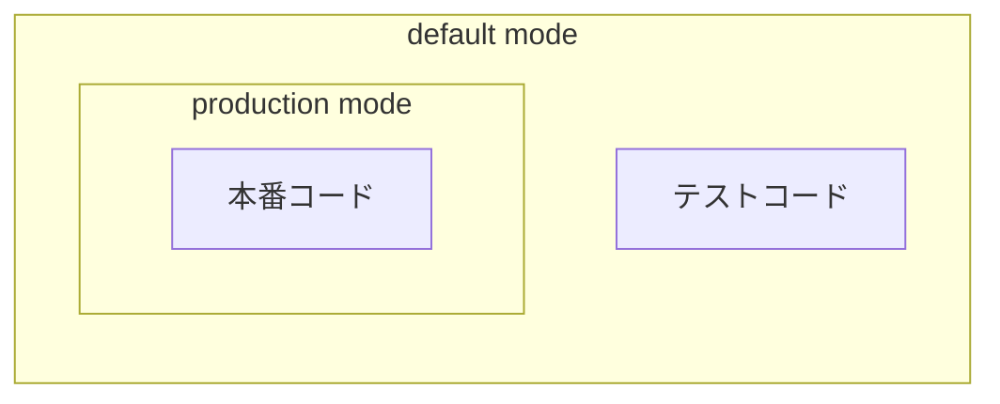
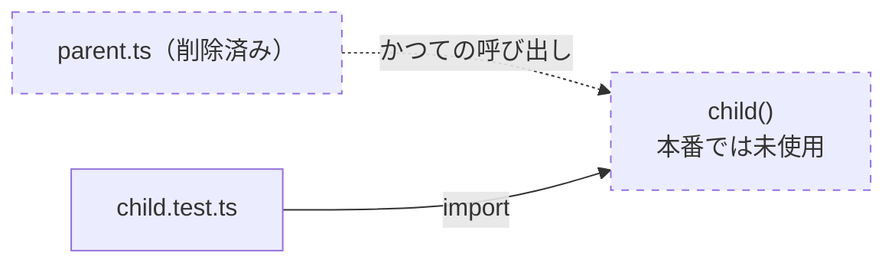

## Knip とは

[Knip](https://knip.dev/) は、JavaScript / TypeScript プロジェクトから「もう使われていないもの」を見つけてくれる lint ツールだ。エントリーポイントから import graph を辿り、そこから到達できないものを機械的に洗い出す。

```bash
# 対話式セットアップ
npm init @knip/config

# 手動セットアップ
npm install -D knip typescript @types/node
npm run knip
```

報告される issue には、次のような種類がある。

| issue の種類 | 検出対象 |
| --- | --- |
| Unused files | どこからも参照されていないファイル |
| Unused exports | どこからも参照されていない export（enum member や namespace member も含む） |
| Unused dependencies | `package.json` にはあるが、コード内で未使用の依存関係 |
| Unlisted dependencies / binaries | コードでは使っているが、`package.json` に未記載の依存関係・バイナリ |
| Unresolved imports | 解決できない import 指定子 |
| Duplicate exports | 同じものを複数の名前で export している状態 |
| Circular dependencies | ファイル間の循環参照（デフォルトは警告レベル） |

## entry と project という2つの概念

Knip の設定は `entry` と `project` という2つの概念を中心に組み立てられている。

| 設定 | 役割 |
| --- | --- |
| `entry` | Knip が import graph を辿り始める起点（起動ファイル、CLI、設定ファイル、生成スクリプトなど） |
| `project` | 解析対象のスコープ |

`entry` は、Knip が import graph を辿り始める起点となるファイルである。`project` は、解析対象となる source ファイルのスコープを定義する。Knip は `project` のスコープの中で `entry` を起点に import graph を辿り、到達できなかったものを Unused として報告する。

## 2つのモード：production / default

Knip は、`entry` と `project` の解析対象を production mode と default mode の2つで切り替えられる。

- **production mode**: ビルド成果物や配布物に含まれ、本番環境で実際に実行されるコードだけに対象を絞って解析する
- **default mode**: production mode の対象に加えて、テストコードなど開発時に存在するコードも含めて解析する



production mode の利点は、テストからは参照されているが本番では使用されていないコードを dead code として検出できることにある。

### 実例

次のような、呼び出し元 `parent.ts` が削除されたのに、呼び出される側 `child.ts` が消し忘れられたケースを考える。

```
src/
├── parent.ts        # このファイルを削除した
├── child.ts         # 本来であればこのファイルは未使用になるはず
└── child.test.ts
```

`child.test.ts` からの import があるので、default mode では `child.ts` は reachable と判定されてしまう。



一方 production mode においては、`child.ts` は本番コードとしてはどこからも呼び出されておらず、dead code として検出できる。

default mode は開発経路も含めた全体の dead code を、production mode は本番で実際に実行されるコードに閉じた dead code を検出する。CI では両方を回して、それぞれの役割を分担させる。

## 設定ファイルの書き方

設定は、プロジェクトルートの `knip.ts` に書く。

> `knip.js` や `knip.json` も設定ファイルとして使える。

### `!pattern` と `pattern!`

`entry` / `project` の対象から除外したい pattern には、先頭に `!` を付けて書く。

`entry` / `project` の対象を production mode だけに絞りたい pattern には、末尾に `!` を付けて書く。

| pattern | production mode | default mode |
| --- | --- | --- |
| `pattern` | 対象 | 対象 |
| `!pattern` | 対象外 | 対象外 |
| `pattern!` | 対象 | 対象外 |
| `!pattern!` | 対象外 | 対象 |

### 実例

次のような構造を考える。

```
.
├── dist/                # ビルド成果物
└── src/
    ├── main.ts          # entry
    ├── *.ts
    ├── *.test.ts        # test entry
    └── test-helpers/
```

このとき、`knip.ts` は次のように書ける。

```ts title="knip.ts"
export default {
  entry: [
    'src/main.ts',
    '!src/**/*.test.ts!'
  ],
  project: [
    'src/**/*.ts',
    '!src/**/*.test.ts!',
    '!src/test-helpers/**!',
    '!dist/**'
  ],
}
```

ビルド成果物である `dist/` は Knip で解析する必要がないので、`'!dist/**'` のように設定し、解析から除外する。

テストファイルである `src/**/*.test.ts` は、default mode のみの解析対象とするため、`entry` と `project` の両方に `'!src/**/*.test.ts!'` を設定する。`entry` 側だけでは、production mode でもテストファイルが `project` の対象に残ったままになり、どの entry からも到達できないファイルとして誤って Unused files 扱いされてしまう。`project` 側にも同じ pattern を設定することで、テストファイルを default mode では解析対象としつつ、production mode の対象からは丸ごと外す、という意図を表せる。

なお、アプリケーション開発において `pattern!` を単独で使う場面は少ない。ライブラリ開発の場合は、ライブラリの公開エントリを `src/index.ts!` のように設定する。

## plugin が entry を自動で見つけてくれる

ここまでは `entry` / `project` を手で書く前提で見てきたが、実際には全部を手で書く必要はない。Knip は zero config、つまり設定ファイルなしでも動くことを目指している。`package.json` の依存関係を見て対応する plugin を自動的に有効化し、そのツール固有の設定ファイルや規約を理解した上で、実行経路に応じた entry を自動で足してくれる。

| plugin | 認識するもの |
| --- | --- |
| TypeScript | `tsconfig.json` の `include` / `paths` |
| ESLint | config ファイルと plugin の依存関係 |
| Next.js | `pages` / `app` ディレクトリの規約に基づく entry |
| Vitest / Jest | テストファイルと setup ファイルの entry |
| Storybook | story ファイルの entry |
| Playwright | e2e テストの entry |
| GitHub Actions | workflow が参照するスクリプト |

対応 plugin は100 以上あり、依存関係を追加すれば大半は設定なしで拾われる。構成が一般的なプロジェクトなら、`knip.ts` を書かなくても十分なことも多い。一覧は公式ドキュメントの [Plugins ページ](https://knip.dev/explanations/plugins)で確認できる。

{/*

## 便利なオプション：configuration hints と strict mode

### configuration hints ―― 設定そのものの不備を教えてくれる

Knip は、コードの issue だけでなく `knip.ts` の設定が古くなっていないかもチェックしてくれる。これが configuration hints で、次のようなケースを検出する。

| 検出内容 | 例 |
| --- | --- |
| 何にもマッチしない pattern | リネーム・削除済みのファイルを指す `entry` / `project` / `ignore` |
| 不要になった ignore エントリ | 該当する issue がもう発生していない `ignoreDependencies` などの指定 |
| monorepo でのトップレベル `entry` / `project` | `workspaces` を使う構成では無視されるため、各 workspace 側へ移す必要がある |
| stale workspace | リネーム・削除済みの package を指したままの `workspaces` のキー |

configuration hint はデフォルトでは警告として表示されるだけで、終了コードには影響しない。CI で確実に潰したいなら `--treat-config-hints-as-errors` を付ける。

```bash
knip --treat-config-hints-as-errors
```

ignore を書いて満足するのではなく、その ignore が今も必要かどうかを Knip 自身に確認させ続けられるのが configuration hints の役割だ。

### `--strict` ―― production mode をさらに厳しくする

`--strict` は `--production` を暗黙的に含み、次の2点を追加でチェックする。

- workspace を分離し、各 workspace が自身の `dependencies` だけを使っているかを検証する。monorepo では node_modules が hoisting されるため、直接宣言していない他 package の依存が手元から解決できてしまうことがある。`--strict` はこれを見逃さない
- 必須の `peerDependencies` を解析対象に含める

```bash
knip --production --strict
```

通常の production mode が「本番で実際に実行される経路」に対象を絞り込むのに対し、`--strict` は「その経路が依存関係を正しく直接宣言しているか」まで踏み込んで検証する。

*/}

## References

- [Knip](https://knip.dev/)
- [Getting Started - Knip](https://knip.dev/overview/getting-started)
- [Issue Types - Knip](https://knip.dev/reference/issue-types)
- [Plugins - Knip](https://knip.dev/explanations/plugins)
- [Configuration - Knip](https://knip.dev/overview/configuration)
- [Production Mode - Knip](https://knip.dev/features/production-mode)
- [Resolve reported issues - Knip](https://knip.dev/guides/handling-issues)
