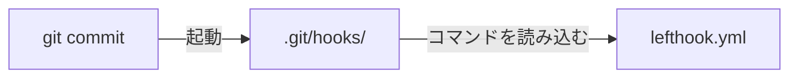

`lefthook.yml` を使うと、Git hooks の認知負荷・メンテコストを下げられる。

## 前提：Git hooks とは

`.git/hooks/` 配下にスクリプトを書くことで自動実行される仕組みだ。

例えば `.git/hooks/pre-commit` に lint を実行するスクリプトを書くと、コミット前に自動で lint を実行できるようになる。

```bash title=".git/hooks/pre-commit"
#!/bin/sh
npm run lint
```

## お手製 Git hooks の辛さ

### Git hooks は git 管理できない

`.git/` 自体が `.gitignore` の対象なので、`.git/hooks/` はバージョン管理下に置けず、チーム共有が難しい。

セットアップ手順を `README.md` に書いて、各自に手動で設置してもらう運用も考えられる。

しかしこれは各自が手元で個別に実行する必要があり、実行し忘れた人だけチェックを素通りできてしまうという構造的な問題がある。

### チェックスクリプトを自前で書くのが大変

チェックスクリプトを自前で書くのが大変という課題もある。

- **並列化**：複数のチェックを並列で実行するスクリプト
- **ステージ済みファイルの絞り込み**：全体に lint を掛けると重いので、ステージ済みファイルだけに絞る処理
- **対象ファイルの絞り込み**：モノレポで「特定のディレクトリに変更があったときだけビルドを回す」ような、差分ファイルに応じて実行を分岐するスクリプト

## lefthook で簡潔に書く

[lefthook](https://lefthook.dev/) は `lefthook.yml` 1 つでこれらを解決する Git hooks マネージャーだ。

```yaml title="lefthook.yml（抜粋）"
pre-commit:
  parallel: true
  commands:
    lint:
      glob: "*.{js,jsx,ts,tsx,json,jsonc}"
      run: npm run lint -- {staged_files}
```

このファイルをコミットするだけで、チーム全員に同じ hooks が配布される。  
嬉しい。

## セットアップ

### ① lefthook を npm install する

```bash
npm install --save-dev lefthook
```

`package.json` の `devDependencies` に `lefthook` が追加される。

```json title="package.json（抜粋）"
{
  "devDependencies": {
    "lefthook": "^2.0.0"
  }
}
```

### ② prepare スクリプトで hooks を自動設置する

`package.json` に `prepare` スクリプトを書き、`npm i` 時に `lefthook install` が実行されるようにする。

```json title="package.json（抜粋）"
{
  "scripts": {
    "prepare": "lefthook install"
  }
}
```

`lefthook install` は `.git/hooks/` 配下に各種スクリプトを設置する。`prepare` は `npm i` や `npm ci` 時に実行されるので、これでチーム全員で同じ hooks が共有される。

### 補足：Git hooks で lefthook.yml のコマンドが実行される仕組み

`lefthook install` で配置される `.git/hooks/` は `lefthook.yml` への参照を持っており、起動時に `lefthook.yml` のコマンドを読み込んで実行する。



## もっと使いこなす

この記事では `pre-commit` の `parallel` / `glob` / `{staged_files}` に絞って説明したが、lefthookにはまだ機能がある。

- `pre-commit` 以外にも、`pre-push` や `commit-msg` など任意の Git hook、さらには独自のカスタムフックも同じ書き方で定義できる  
→ [Hook - Lefthook](https://lefthook.dev/configuration/Hook/)
- `stage_fixed: true` を付けると、lint の自動修正結果を lefthook 自身が再度 `git add` してくれる  
→ [stage_fixed - Lefthook](https://lefthook.dev/configuration/stage_fixed/)
- `glob_matcher: doublestar` を設定すると、`glob` のマッチング挙動を Bash の `**` に近づけられる  
→ [glob_matcher - Lefthook](https://lefthook.dev/configuration/glob_matcher/)

## References

- [What is Lefthook? - Lefthook](https://lefthook.dev/)
- [lefthook install - Lefthook](https://lefthook.dev/usage/commands/install/)
- [Hook - Lefthook](https://lefthook.dev/configuration/Hook/)
- [stage_fixed - Lefthook](https://lefthook.dev/configuration/stage_fixed/)
- [glob_matcher - Lefthook](https://lefthook.dev/configuration/glob_matcher/)
