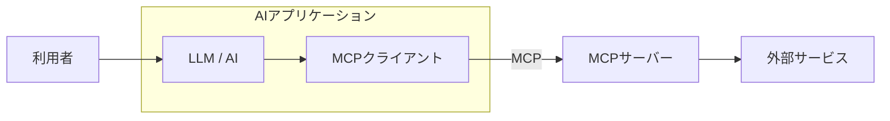

MCP は AI ではない。

> MCP（Model Context Protocol）は、AIアプリケーションを外部システムに接続するためのオープンソース標準です。
>
> MCP を使用することで、Claude や ChatGPT のような AI アプリケーションは、データソース（例：ローカルファイル、データベース）やツール（例：検索エンジン、電卓）およびワークフロー（例：専門的なプロンプト）に接続でき、重要な情報にアクセスし、タスクを実行できるようにします。
>
> MCP を AI アプリケーション用の USB‐C ポートのように考えてください。USB‐C が電子機器を接続するための標準化された方法を提供するのと同様に、MCP は AI アプリケーションを外部システムに接続するための標準化された方法を提供します。

出典: [Model Context Protocol - Introduction](https://modelcontextprotocol.io/docs/getting-started/intro)

MCP はあくまでプロトコルであり、サーバーとクライアントのデータのやり取りの規格である。  
この規格は AI を前提に考えられている。

## AI と MCP の関係

MCP を「AI と外部サービスの通信規格」として捉える。



```text
利用者
  ↓
AIアプリケーション
  ├─ LLM / AI            ← 考える部分
  └─ MCPクライアント       ← MCPで通信する部分
         ↓
     MCPサーバー          ← 機能をMCP形式で公開する部分
         ↓
     外部サービス          ← 実際の処理やデータを持つ部分
```

この図で大事なのは、MCP クライアントも MCP サーバーも LLM / AI 本体ではないということだ。  
MCP は AI のように依頼を理解したり、何を実行するかを判断したりするものではない。  
AI が外部サービスを利用するための通信規格である。

## References
- https://modelcontextprotocol.io
- https://fukabori.fm/episode/130
- https://www.youtube.com/watch?v=RTMH7X8BNvg
