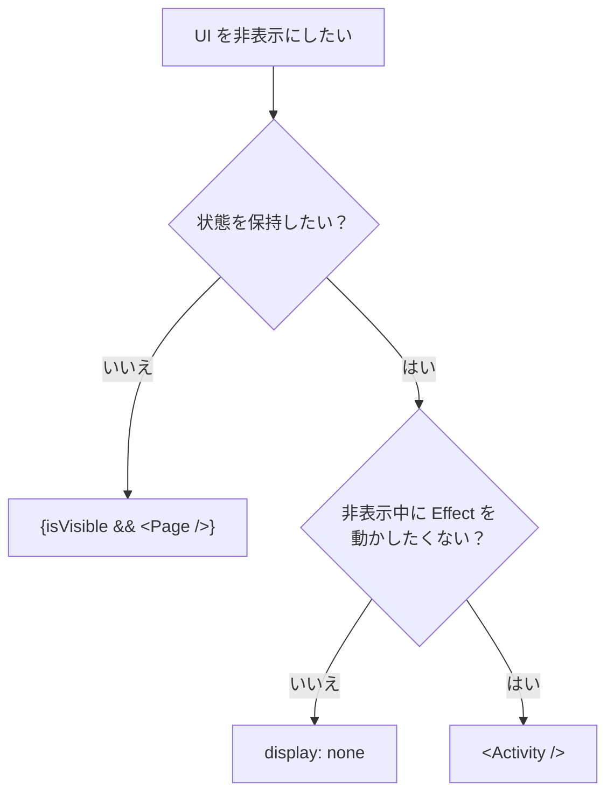

React v19.2 で `<Activity>` が正式リリースされました。

## これまでの辛さ

React でコンポーネントの表示を切り替える場合、一般的には条件付きレンダーを使います。

```tsx
{isVisible && <Page />}
```

この方法では、`isVisible` が `false` になると `<Page />` がアンマウントされます。

アンマウントされたコンポーネントの state や DOM は破棄されるため、再び表示したときには初期状態からの再開になります。

非表示にした UI の状態を保持したい場合は、state を親コンポーネントへ持ち上げるなど、追加の設計が必要でした。

## `<Activity>` でどう解決されるか

`<Activity>` は、UI の一部を表示・非表示にしながら、その内部状態を保持するためのコンポーネントです。

```tsx
<Activity mode={isVisible ? "visible" : "hidden"}>
  <Page />
</Activity>
```

`<Activity>` は `visible` と `hidden` の 2 つのモードを持ちます。

`visible` の場合は、通常通り子コンポーネントが表示されます。

`hidden` になると、子要素は `display: none` によって非表示になります。

再び `visible` になると、以前の state と DOM を使って表示が復元されます。

## `display: none` でよくない？

単に見た目だけを隠し、state や DOM を保持したいだけであれば、`display: none` でも十分です。

```tsx
<div style={{ display: isOpen ? "block" : "none" }}>
  <Form />
</div>
```

この方法でも、フォームを閉じて再び開いたときに入力内容を残せます。

`<Activity>` との違いは、非表示中の React の処理です。

`display: none` では、コンポーネントはマウントされたままです。そのため、Effect は動き続け、state の更新も通常の優先度で処理されます。

一方、`<Activity>` では、表示中の UI が `hidden` になると Effect のクリーンアップ関数が実行され、再び `visible` になったときにセットアップ関数が実行されます。

なお、非表示中もレンダー処理は実行されますが、表示中のコンテンツより低い優先度で処理されます。

そのため、非表示中も Effect を動かし続けて問題ない小さな UI であれば、`display: none` で十分です。

逆に、非表示中は停止したい処理（WebSocket、イベントリスナー、購読、タイマーなど）がある UI では、`<Activity>` が適しています。

## どう使い分ける？



## まとめ

`<Activity>` の特徴をまとめると、次のようになります。

- 非表示中の状態を保持する
- 非表示になると Effect をクリーンアップする
- 非表示中もレンダーする（優先度：低で）


## References

- [Activity – React](https://ja.react.dev/reference/react/Activity)
- [React 19.2 – React](https://ja.react.dev/blog/2025/10/01/react-19-2)
- [React Labs: ビュー遷移、Activity、その他もろもろ – React](https://ja.react.dev/blog/2025/04/23/react-labs-view-transitions-activity-and-more)
